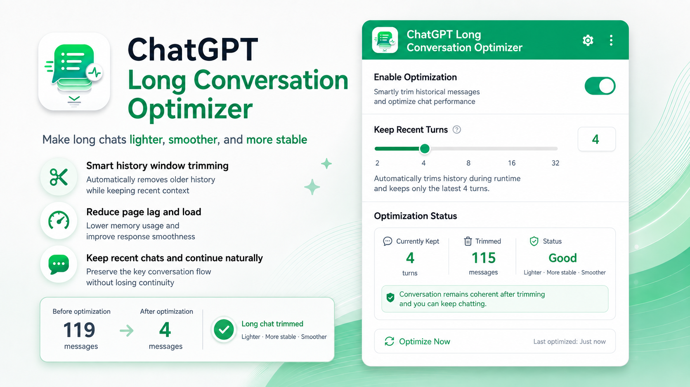

# ChatGPT Long Conversation Optimizer

[English](./README.md) | [简体中文](./README.zh-CN.md)



A Chrome MV3 extension for ChatGPT Web that trims older conversation history **before it reaches React rendering**, helping reduce DOM size, memory usage, and rendering load in long conversations.

## Features

- **History window trimming** — keeps only the most recent visible conversation turns.
- **WASM trimming core** — uses WebAssembly compiled from AssemblyScript to process conversation trees efficiently.
- **Supports current and legacy ChatGPT conversation APIs** — handles both `messages[]` responses and legacy `mapping` responses.
- **Load older messages when needed** — temporarily expands the history window so you can view earlier content.
- **Safe runtime window control** — allows a small buffer while you keep chatting, then safely reloads and trims back to your configured window.
- **No direct React DOM removal** — avoids breaking React Fiber / DOM consistency.
- **Debug logging** — optional `[CLF]` logs in DevTools for inspecting trimming behavior.

For example, with the window configured to keep 4 visible turns, a long conversation can be reduced from:

```text
119 visible turns → 4 visible turns
185 messages      → 5 messages
```

The exact message count varies depending on system, tool, hidden, and other internal message types.

## Installation

```bash
git clone https://github.com/blankTwo/chatgpt-lag-fixer.git
cd chatgpt-lag-fixer
npm install
npm run build
```

Then in Chrome:

1. Open `chrome://extensions`
2. Enable **Developer mode**
3. Click **Load unpacked**
4. Select the `extension/` directory

## Usage

Click the extension icon in the browser toolbar.

- **Enable Optimization** — turn long-conversation optimization on or off.
- **Keep Recent Turns** — choose how many recent visible turns should remain in the page window.
- **Optimize Now** — reload the current ChatGPT page and apply the latest settings immediately.
- **Debug Logs** — print trimming and runtime status to the ChatGPT DevTools Console.

## How It Works

```text
ChatGPT conversation response
          ↓
MAIN-world fetch hook
          ↓
Detect response structure
          ↓
legacy mapping ─────────────┐
                            ├→ WASM keeps the latest N visible turns
messages[] → temporary tree ┘
          ↓
Map the retained nodes back to the original response
          ↓
React receives only the trimmed conversation window
```

For current ChatGPT conversation responses, the extension adapts the returned `messages[]` data into a temporary tree, runs the same WASM trimming logic, and maps the retained nodes back into the original response structure.

After trimming, native backward pagination is blocked for the active trimmed window so scrolling does not silently restore older history. Older content can still be requested through the extension's own **load older messages** flow.

### What Counts as a Visible Turn

The trimming budget counts visible `user` and `assistant` messages that are not marked as visually hidden. System, tool, and hidden messages may still be retained when needed for structure, but they do not consume the visible-turn budget.

## Runtime Behavior

The initial conversation load is handled entirely at the data layer. The extension does not remove already-rendered ChatGPT conversation DOM nodes.

While you continue chatting, the extension allows a small temporary buffer. Once the runtime window reaches the configured limit plus the buffer, it waits for streaming to finish, waits for the page to stabilize, checks that there is no unsent draft, and then safely reloads the page so the history can be trimmed back to the configured window.

## Permissions

The extension uses:

- `storage` — saves optimization settings and status.
- `activeTab` — reloads the current tab from the popup.
- `https://chatgpt.com/*`
- `https://chat.openai.com/*`

## License

MIT
