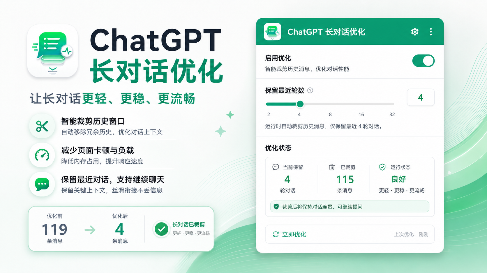

# ChatGPT 长对话优化

[English](./README.md) | [简体中文](./README.zh-CN.md)



一个面向 ChatGPT Web 的 Chrome MV3 扩展，通过在历史会话数据进入 React 渲染层之前裁剪旧消息，降低长对话页面的 DOM、内存与渲染负载。

## 功能

- **历史会话裁剪**：只保留最近 N 个可见轮次。
- **WASM 裁剪核心**：使用 AssemblyScript 编译的 WebAssembly 处理会话树。
- **兼容新旧会话接口**：支持新版 `messages[]` 响应和旧版 `mapping` 响应。
- **加载更早**：需要查看旧内容时，可以临时扩大历史窗口。
- **运行期安全收窗**：继续聊天时允许少量缓冲，达到上限后安全刷新并裁回设定窗口。
- **不直接删除 React DOM**：避免破坏 React Fiber 与真实 DOM 的一致性。
- **调试日志**：可在 Popup 中开启，在 DevTools 中查看 `[CLF]` 裁剪日志。

例如设置只保留最近 4 个可见轮次时，长对话可以从：

```text
119 个可见轮次 → 4 个可见轮次
185 条 messages → 5 条 messages
```

实际消息数量会随 system、tool、hidden 等内部消息结构变化。

## 安装

```bash
git clone https://github.com/blankTwo/chatgpt-lag-fixer.git
cd chatgpt-lag-fixer
npm install
npm run build
```

然后在 Chrome 中：

1. 打开 `chrome://extensions`
2. 开启「开发者模式」
3. 点击「加载已解压的扩展程序」
4. 选择项目中的 `extension/` 目录

## 使用

点击浏览器工具栏中的扩展图标：

- **启用优化**：开启或关闭长对话优化。
- **保留最近轮数**：设置页面保留的最近可见轮次数量。
- **立即优化**：刷新当前 ChatGPT 页面并立即应用最新设置。
- **调试日志**：在 ChatGPT 的 DevTools Console 中输出裁剪与运行状态。

## 工作原理

```text
ChatGPT 历史会话响应
        ↓
MAIN world fetch hook
        ↓
识别响应数据结构
        ↓
旧版 mapping ───────────────┐
                            ├→ WASM 保留最近 N 个可见轮次
新版 messages[] → 临时树 ──┘
        ↓
把保留结果映射回原始响应
        ↓
React 只接收到裁剪后的历史窗口
```

对于当前 ChatGPT 的 `messages[]` 会话结构，扩展会先构造成临时树，再交给同一套 WASM 裁剪逻辑，最后把保留结果映射回原始响应。

裁剪后会阻止当前窗口通过原生上一页分页自动把旧历史重新加载回来，避免滚动时绕过裁剪。需要查看更早内容时，仍然可以使用扩展自己的「加载更早」流程。

### 什么算一个可见轮次

裁剪预算只统计未被视觉隐藏的 `user` 和 `assistant` 消息。system、tool 和 hidden 消息在结构需要时仍可能被保留，但不会占用可见轮次预算。

## 运行期行为

首次打开或刷新历史会话时，扩展只在数据层裁剪，不会直接删除 ChatGPT 已经渲染出来的 DOM。

继续聊天后，扩展允许一个小的临时缓冲。达到设定窗口加缓冲上限后，会等待 streaming 结束、等待页面稳定、确认输入框没有未发送草稿，然后安全刷新页面，再重新裁回设定窗口。

## 权限

扩展使用：

- `storage`：保存优化设置和状态。
- `activeTab`：从 Popup 刷新当前页面。
- `https://chatgpt.com/*`
- `https://chat.openai.com/*`

## License

MIT
